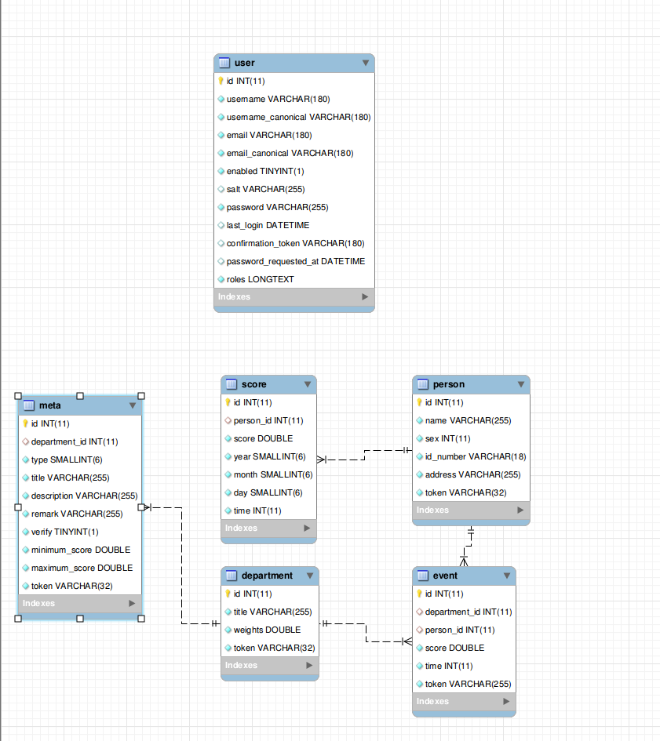

# 诚信办中心系统
> 原型

## 架构逻辑
[请看](https://github.com/ohmountain/qingzhen-demo)

## 基本数据结构(元数据)


## 安装和运行
```shell

git clone https://github.com/ohmountain/cxb-prototype.git

cd cxb-prototype

composer install # 并依次输入数据库信息

php bin/console doctrine:database:create # 创建数据库
php bin/console doctrine:schema:update   # 更新表结构到数据库

php bin/console run:server               # 运行(暂无实质内)

```
